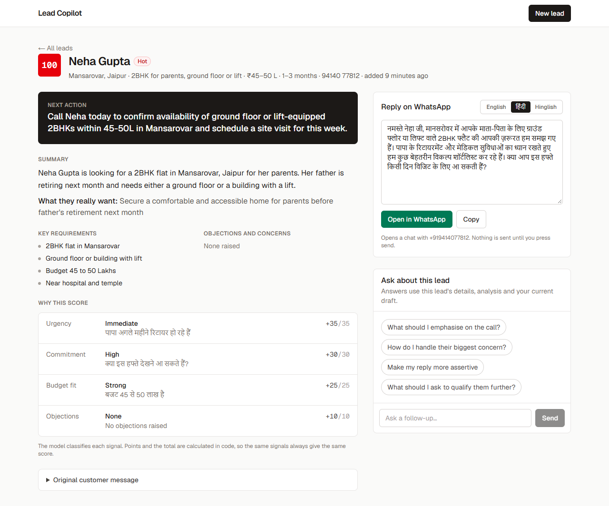
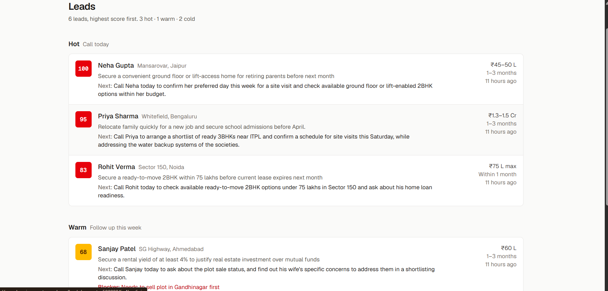
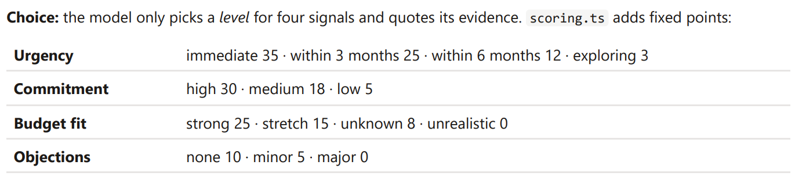

# Lead Copilot

Helps a real-estate salesperson see which inbound leads to call first, what each customer actually wants, and how to reply, on WhatsApp and in the customer's own language.

**Live app:** https://masal-ai-pi.vercel.app · **Demo video:** drive: https://drive.google.com/file/d/1xhcnWWola2WN5aeBTNpdFz8zh4Dhexmf/view?usp=drivesdk
 ·  **Youtube** : https://www.youtube.com/watch?v=jE3u9WU7S1U





## What it does

- **Intake:** a form for name, location, requirement, budget, timeline and the customer's message. Or record or upload a voice note and the form fills itself.
- **AI analysis:** summary, intent, key requirements, objections, next action and a suggested WhatsApp reply.
- **Prioritised list:** leads are scored 0–100 and grouped into Hot, Warm and Cold. Each row shows the next action and any blocker.
- **Lead page:** the next action first, the score explained factor by factor, a reply you can switch between English, Hindi and Hinglish and open in WhatsApp, and a chat for follow-up questions about that lead.

## Added feature: voice-note intake and WhatsApp reply

- **Before:** many leads arrive as WhatsApp voice notes or calls. Gemini transcribes the recording and fills the form, leaving out anything it didn't hear. The salesperson checks the form before saving.
- **After:** the reply defaults to the language the customer wrote in. It can be translated, edited, or replaced with a chat answer ("make my reply more assertive", then _Use as WhatsApp reply_). It opens in WhatsApp with the number and text filled in, and nothing is sent automatically.

## How it works

Next.js serves both the UI and the API. Pages read Postgres (Neon) directly. Every model call goes through a server route, so the API key never reaches the browser.

| Feature     | Code                | AI SDK call                                            |
| ----------- | ------------------- | ------------------------------------------------------ |
| Analysis    | `lib/ai/analyze.ts` | `generateText` + Zod output schema                     |
| Chat        | `lib/ai/chat.ts`    | `streamText`, history saved in Postgres                |
| Translation | `lib/ai/reply.ts`   | `generateText`                                         |
| Voice note  | `lib/ai/voice.ts`   | `generateText` with an audio file part + output schema |

**Model:** `gemini-3.5-flash` (free tier) with low thinking. It falls back to `gemini-3.5-flash-lite` on a rate limit (429) or overload (503).

**Stack:** Next.js 16, TypeScript, Tailwind CSS, Vercel AI SDK, Prisma, Neon Postgres, Zod, Vitest.

## Key decisions

- **The AI classifies; code scores.** The model labels four signals (urgency, commitment, budget fit, objections) with fixed levels and quotes its evidence. [`scoring.ts`](src/lib/scoring.ts) turns those labels into points, so the same signals always give the same score, and the lead page shows why.
- **Prompts were tuned on real output.** Early replies invented amenities and promised things nobody had checked. They also copied the prompt's examples and assumed a male sender in Hindi. The prompts now prevent each of these.
- **The chat is grounded on the server.** The browser sends only the new question. The server rebuilds the context from the stored lead, its analysis and the chat history on every turn.
- **Postgres, not in-memory storage.** Serverless instances on Vercel don't share memory, so in-memory leads would disappear.
- **Built for the free tier.** Free-tier quotas are per model (5 requests/min on Flash), so a small middleware retries once on Flash-Lite. Low thinking cut analysis time from about 20 seconds to about 4.

## Run locally

```bash
npm install
cp .env.example .env        # DATABASE_URL and GOOGLE_GENERATIVE_AI_API_KEY
npx prisma migrate deploy
npm run dev                 # http://localhost:3000
npm run seed                # optional: sends 6 sample leads through the real AI
npm test                    # unit tests for scoring, validation, WhatsApp links and error handling
```

## Known limitations

- No login or rate limiting, so anyone with the URL can use the AI quota.
- Free-tier limits: heavy use within a minute shows "try again in a minute".
- The fallback model can label a borderline signal differently, so scores can differ slightly between models.
- Budget fit uses the model's general knowledge of prices, not live market data.
- Leads can't be edited or re-analysed, and the list has no pagination.

## AI usage disclosure

- **Claude Code (Anthropic):** used for writing the frontend, testing against the Gemini API, and drafting this README.
- **My part:** I chose the scope and the added feature, designed the architecture, wrote the backend, prompts, and tests, reviewed and approved the plan and design decisions, set up and deployed the app on Vercel and Neon, and tested it.
- **Gemini 3.5 Flash:** the model used inside the product.
